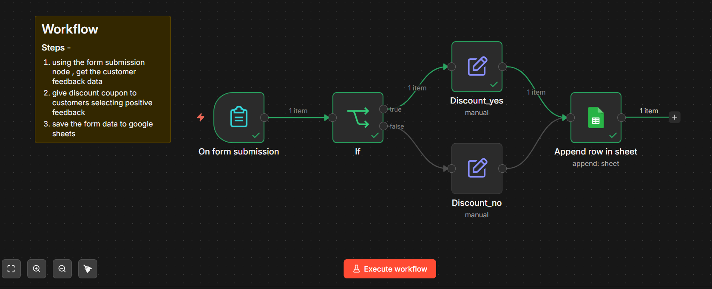

# 01 — User Feedback Form Workflow

## 🖼 Workflow Preview

## 📌 What it does
Collects customer feedback via an n8n form and automatically:
- Routes responses based on feedback type (Positive / Negative / Neutral)
- Assigns a discount coupon (Yes/No) using a Set node
- Appends all data to a Google Sheet

## 🧩 Nodes Used
- **Form Trigger** — collects Email, Name, Age, Feedback
- **IF Node** — checks if Feedback is "Positive"
- **Set Node (x2)** — assigns "Give Discount" as Yes or No
- **Google Sheets** — appends the full row to a spreadsheet

## 📂 Files
- `User_Feedback_Data.json` — importable n8n workflow
- `workflow.png` — screenshot of the workflow canvas

## 💡 Key Learnings
- How to use Form Trigger node
- Conditional branching with IF node
- Mapping dynamic data to Google Sheets
- Using Set node to add custom fields to JSON

## 🚀 How to Use
1. Download `User_Feedback_Data.json`
2. Open n8n → Click **Import from file**
3. Upload the JSON
4. Set up your own Google Sheets credential
5. Update the Sheet ID to point to your spreadsheet
6. Hit **Execute Workflow** to test!
